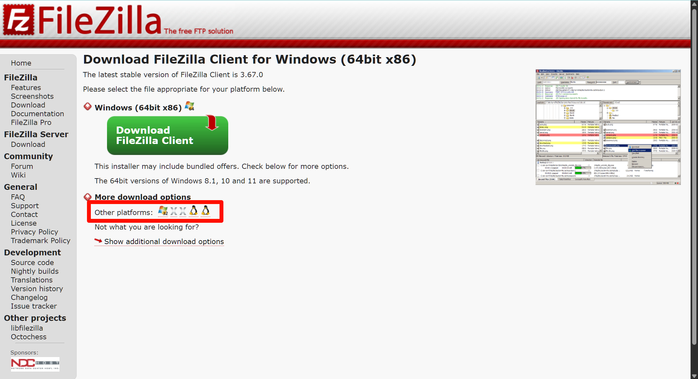
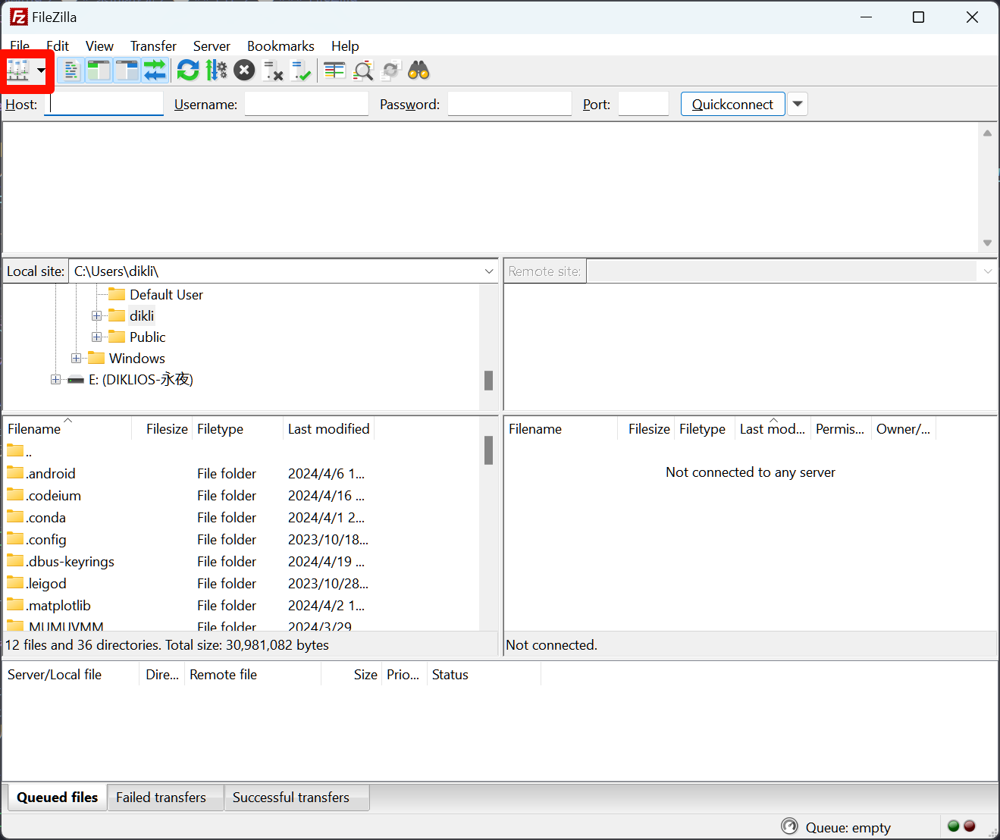
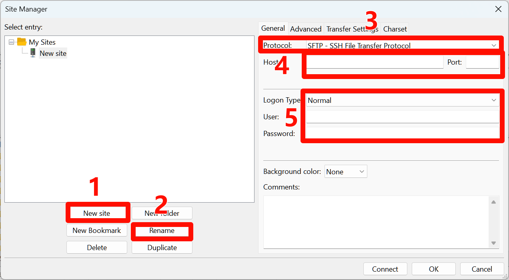
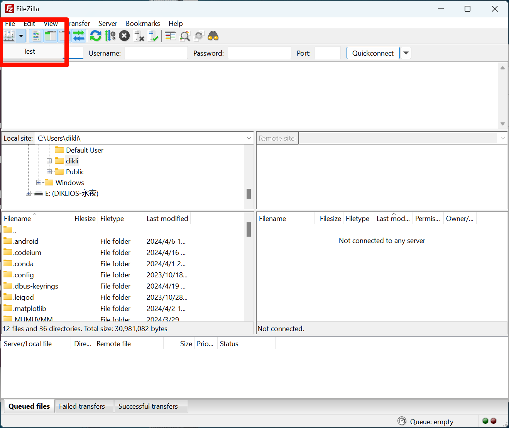
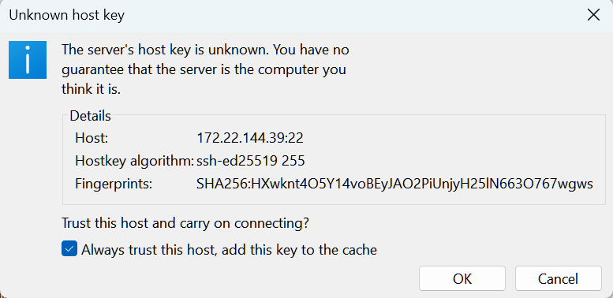
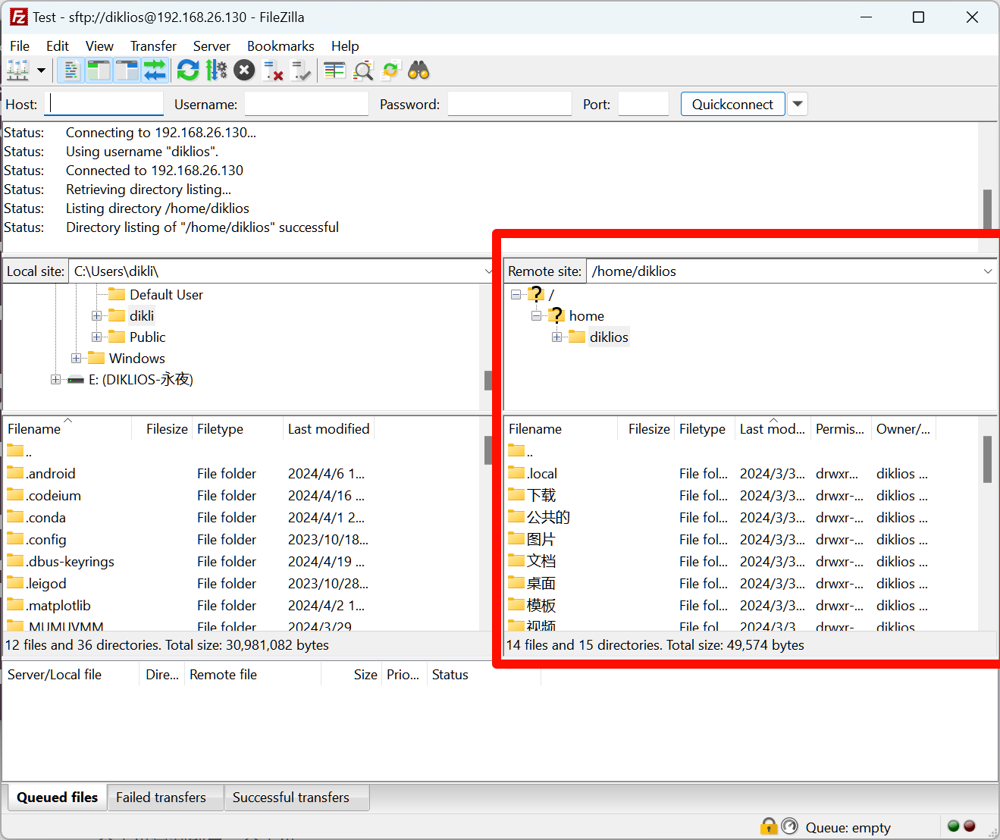

# 桌面环境

## FTP

### FileZilla

#### 下载安装

- 官网：[FileZilla - The free FTP solution (filezilla-project.org)](https://filezilla-project.org/)
- 下载并安装客户端：[Download FileZilla Client for Windows (64bit x86) (filezilla-project.org)](https://filezilla-project.org/download.php?type=client)
  - 注意下载的非服务端
  - 其他平台下载参考：

#### 使用方法

1. 打开站点管理器

2. 新建站点-重命名-选择 FTP 传输方式为 SFTP（如果不能使用则换回默认设置）-填写主机 ip 和端口（端口默认 22 不需要填写）-选择登录方式（一般直接填写用户名和密码即可）

3. 连接站点-信任站点-传输文件（就像操作本地文件夹一样，不再演示）

# 非桌面环境（终端环境）

## rcp(不推荐使用)

- rcp 指令用在远端复制文件或目录
- rcp 是一种基于传统的 UNIX rsh（远程 shell）协议的文件复制工具。它使用不加密的传输方式，将文件从一个主机复制到另一个主机。
- 由于缺乏加密，rcp 在网络中传输的数据是明文的，容易受到窃听和篡改的风险。

### 基本语法

- `rcp [-pr][源文件或目录][目标文件或目录]`
  - -p：保留源文件或目录的属性，包括拥有者，所属群组，权限与时间。
  - -r：递归处理，将指定目录下的文件与子目录一并处理。
- rcp 命令的操作规则与 scp 基本一致，参考 scp 命令即可，这里不再赘述

## scp(推荐使用)

- scp 是 secure copy 的缩写, scp 是 linux 系统下基于 ssh 登陆进行安全的远程文件拷贝命令。
- scp 是在 rcp 的基础上发展而来的工具，它使用 SSH（Secure Shell）协议进行安全的文件复制。
- 通过使用 SSH，scp 在传输文件时会进行加密，确保数据的机密性和完整性。它提供了与 rcp 类似的命令行接口，但在传输文件时更加安全可靠。

### 语法

- `scp [可选参数] file_source file_target`
- 参数
  - -r： 递归复制整个目录。
  - -i identity_file：从指定文件中读取传输时使用的密钥文件，此参数直接传递给 ssh。
  - -P：大写 P，指定 ssh 的端口

### 文件和文件夹传输规则

- 复制的源文件会强制覆盖目标文件，所以最好确定原来那里没有文件，与大家想象中不一样的是，scp 并不像 cp 命令那样，可以添加`-i`参数保证不覆盖源文件
- **复制文件或者文件夹时，必须保证目标文件夹存在**
- 文件夹名加不加斜杠`/`没有影响
  - 对于源路径，scp 会根据路径的最后一个元素是文件还是文件夹来决定是传输文件还是传输整个文件夹
  - 对于目标路径，scp 命令中指定的路径是否以斜杠结尾也没有影响

#### 复制文件

- 复制源文件到目标文件夹下：`scp 源文件路径 目标文件夹`
- 复制源文件到目标文件夹文件夹下并改名：`scp 源文件路径 目标文件夹/新文件名`
- 复制源文件夹下的所有文件到目标文件夹下：`scp 源文件夹路径/* 目标文件夹`

#### 复制文件夹

- 复制文件夹到某个文件夹下：`scp -r 源文件夹路径 目标文件夹`，最终得到：`目标文件夹路径/源文件夹`
- 复制文件夹到某个文件夹下并改名：`scp -r 源文件夹路径 目标文件夹/新文件夹名`
  - 注意，新文件夹名必须原本不存在，否则源文件夹将会传输到新文件夹名下
  - 注意，这不是创建了文件夹，即`目标文件夹`**必须存在**，只是源文件夹复制过去改名了

### 远程连接

- scp中的源路径和目标路径可以是远程地址，远程地址的格式是`远程主机用户名@远程主机IP地址:`
  - 如果不指定用户名，则命令执行后需要输入用户名和密码，但是一般推荐加上
  - 一定最后要加上冒号`:`，区分远程主机**地址**和远程主机**路径**
  - 如果不想总是手动输入密码，可以增加密钥文件

- 本地和远程之间传输
  - 本地传输到远程：`scp 本地路径 远程主机用户名@ip地址:/路径`
  - 远程传输到本地：`scp 远程主机用户名@ip地址:/路径 本地路径`
- 远程和远程之间传输
  - 参考
    - <https://superuser.com/questions/686394/scp-between-two-remote-hosts-from-my-third-pc>
    - <https://superuser.com/questions/1581028/scp-using-local-machine-as-jump-host>
  - 注意！！！这种方式需要添加密钥，即使能通过输入密码的方式登录两台远程主机也是不行的
    - 在本机上使用`ssh-keygen`生成密钥：`ssh-keygen -t rsa -b 4096 -C "你的邮箱"`
    - 使用`ssh-copy-id`上传密钥：`ssh-copy-id -p port username@远程主机ip地址`，两台远程主机都上传
  - 基本语法：`scp 远程主机1用户名@远程主机1的IP地址:路径 远程主机2用户名@远程主机2的IP地址:路径`

## lrzsz(不推荐使用)

- 在某种情况下，我们也许使用了跳板机（relay）访问远程主机，即：`本地主机->跳板机1->跳板机2->...->实际访问的主机`，此时经过多个嵌套的ssh登录到了真正的远程主机，使用rcp、scp命令就无法一次性传输文件，非常麻烦。
- lrzsz(rz/sz) 工具则可以完成这样的传输需要，但是此工具从1998年之后不再更新，而且部分终端不支持——支持 rzsz 的终端有 xshell 、secureCRT，而 putty 和 MobaXterm 均不支持。故不推荐使用，而推荐使用trzsz。

## trzsz(推荐使用)

- trzsz ( trz / tsz ) 始于 ==iTerm2 + tmux 用不了 rz / sz== ，使用 Python 开发，兼容 tmux ，有进度条，支持目录传输，支持拖动上传。
- 为了支持 web 页面使用 trzsz ( trz / tsz ) 上传和下载，以及支持 electron 开发的一系列终端（ 如 tabby 、electerm 等 )，开发了 js 版本 [GitHub - trzsz/trzsz.js: trzsz.js is the js version of trzsz, supports webshell running in browser, terminal built with electron, etc.](https://github.com/trzsz/trzsz.js)
- 为了支持更多的原生终端使用 trzsz ( trz / tsz )，开发了 go 版本 [GitHub - trzsz/trzsz-go: trzsz-go is the go version of trzsz, supports native terminals that support a local shell.](https://github.com/trzsz/trzsz-go)

### 安装

- trzsz并不被Linux系统自带，所以需要安装，为了支持更多的原生终端，我们推荐安装go语言版本，具体安装方法参考：<https://github.com/trzsz/trzsz-go#installation>，以下是由于常用Ubuntu系统，所以只展示Ubuntu系统怎么安装
- 安装trzsz实现，**本地机器和最终远程客户机都需要安装**
  - `sudo apt update && sudo apt install software-properties-common`
  - `sudo add-apt-repository ppa:trzsz/ppa && sudo apt update`
  - `sudo apt install trzsz`
- 此外还可以安装特色的ssh终端，直接提供trzsz支持，推荐使用[trzsz-ssh ( tssh )](https://github.com/trzsz/trzsz-ssh)
  - 如果已经安装了go版本的`trzsz`实现，可以直接安装：`sudo apt install tssh`
  - 同时最终远程客户机仍然需要安装`trzsz`
  - 以下教程不包含`tssh`的使用方法，工具在登录方面确实很方便，但是涉及到一些ssh配置的内容，可以自行研究

### 使用

- 先从本地登录服务器，必须使用`trzsz`进行登录：`trzsz ssh username@ip`
- 再从远程服务器登录另一台服务器，此时不需要使用`trzsz ssh`，可以直接使用`ssh`
- 上传，执行命令后启动文件管理器选择文件或文件夹
  - 上传文件：`trz`
  - 上传文件夹：`trz -d`
- 下载，执行命令后启动文件管理器选择路径保存
- 下载文件：`tsz 文件路径`
- 下载文件夹：`tsz -d 文件夹路径`
- 注意事项
  - 最开始的`trzsz ssh`或者`tssh`，必须在有桌面环境上，不能直接从wsl或者无桌面环境系统上启动，因为需要调用文件管理器点击
  - `trzsz`不需要在中间跳板机上安装

